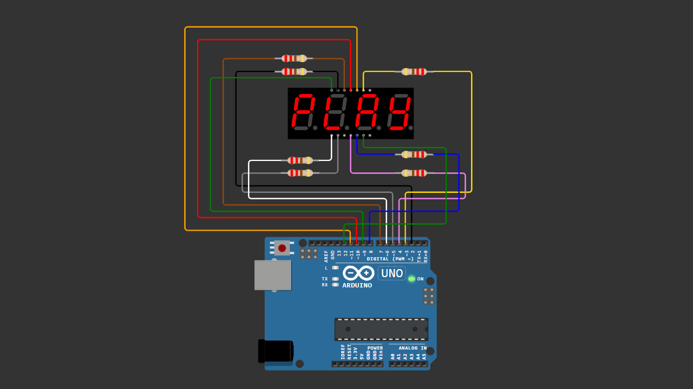

# Arduino 4 Digit 7 Segment PLAY STOP Animation (Common Anode)

A beginner-friendly Arduino project demonstrating how to display animated text ("PLAY" and "STOP") on a 4-digit 7 segment display using multiplexing.

This project features smooth transitions, blinking effects, and anti-ghosting techniques inspired by classic VCD player displays.

---

## 📌 Project Overview

This project uses a 4-digit 7 segment display to simulate a classic media player interface.

Instead of displaying numbers, the Arduino controls individual segments to form characters:

- PLAY animation → P → L → A → Y  
- STOP animation → S → T → O → P  
- Blinking effect → Inspired by old VCD/DVD players  
- Clean transitions → No ghosting between frames  

Multiplexing is used to control all digits efficiently using limited I/O pins.

---

## 🧰 Components Required

- Arduino Uno / Nano  
- 4 Digit 7 Segment Display (Common Anode)  
- 220Ω Resistors x7 (for segment pins)  
- Jumper Wires  
- Breadboard (optional)  

---

## 🔌 Wiring Connections

### Segment Pins (WITH RESISTORS)

| Segment | Arduino |
|--------|--------|
| a      | Pin 2  |
| b      | Pin 3  |
| c      | Pin 4  |
| d      | Pin 5  |
| e      | Pin 6  |
| f      | Pin 7  |
| g      | Pin 8  |

---

### Digit Control Pins (NO RESISTOR)

| Digit | Arduino |
|------|--------|
| D1   | Pin 9  |
| D2   | Pin 10 |
| D3   | Pin 11 |
| D4   | Pin 12 |

---

## 📷 Wiring Diagram

> Make sure your wiring matches the diagram before uploading the code.

---

## 💻 Arduino Code

You can download the Arduino sketch here:

[Download Arduino Code](arduino_4digit_7segment_play_stop_common_anode.ino)

Or open the `.ino` file directly inside this repository.

---

## 🚀 Getting Started

1. Connect all components according to the wiring table.  
2. Upload the provided Arduino sketch.  
3. Power the Arduino.  
4. Observe the animation on the display:

   - PLAY animation appears  
   - Blinks like a classic VCD player  
   - Turns OFF briefly  
   - Then shows STOP animation  
   - Repeats continuously  

---

## 🧠 Learning Concepts

This project helps you understand:

- Multiplexing 7 segment displays  
- Segment control logic  
- Common Anode vs Common Cathode differences  
- Anti-ghosting techniques  
- Timing using `millis()` and delays  
- Creating animation effects on LED displays  

---

## 🔄 Possible Improvements

You can expand this project by adding:

- Push button control (manual PLAY/STOP)  
- Buzzer sound effects (like VCD player beep)  
- Potentiometer for speed control  
- Scrolling text (HELLO WORLD)  
- Upgrade to MAX7219 or TM1637 module  

---

## 🎥 Video Tutorial

Watch the full step-by-step tutorial on YouTube:

👉 (Add your video link here)

In this video, you will see:
- Complete wiring demonstration  
- Code explanation  
- Multiplexing concept  
- Animation testing (PLAY & STOP)  
- Common anode troubleshooting tips  

If this project helps you, consider subscribing for more Arduino tutorials 🚀

---

## 📄 License

This project is open-source and free to use for educational purposes.

---

Happy Coding 🚀
